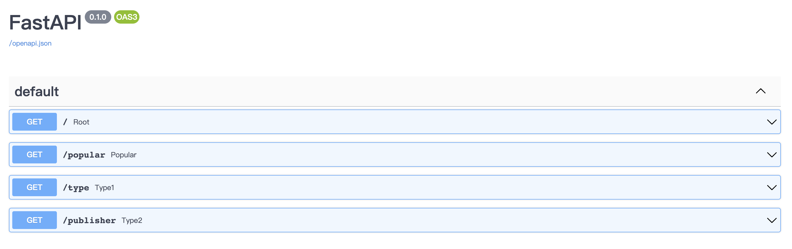

# FINAL PROJECT

## TEAM MEMBER

MING ZHONG(mz179), XINZHU YUAN(XY142), YITONG WANG(yw471)


## DATASET
Kaggle: https://www.kaggle.com/datasets/gregorut/videogamesales
This dataset is about Video Game Sales Analysis, it includes the title, genre, when the game was released, who published it, and how much it sold around the world.


## SQL Queries

1.Find the top 10 most popular video games according to the global sales. 


2.Find the types of games that users preferred from 2011 to 2015, 2015-2020.

From the results, we can find that in the last ten years, the change is quite big, sports competition games and shooting type exchange their position, while action games is still the top position.

3.Find the top 10 global publishers from 2011-2015, 2015-2020.

From the results we see that Blizzard has changed dramatically in the past decade, from the top three to the eighth place. Square Enix, which merged with Eidos and ran the studio's Tomb Raider franchise, has emerged as the bestselling Final Fantasy franchise in video game history. Nintendo and Sega dropped out of the top 10




## Containerzed FastApi
```docker build . ```

```docker image ls ```

```docker run -p 127.0.0.1:8080:8080 cf197d56f35c```


## Continuous Integration & Continuous Delivery
1. continuous integration: we use github actions to check the commits.
2. continuous delivery: we push our docker iamge to the AWS ECR to realize it. we also use AWS AppRunner to deploy the container.

AppRunner link: https://4vpemuypdy.us-east-1.awsapprunner.com
